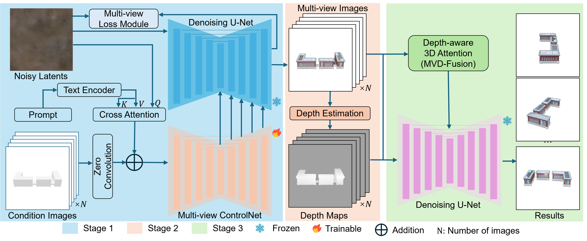
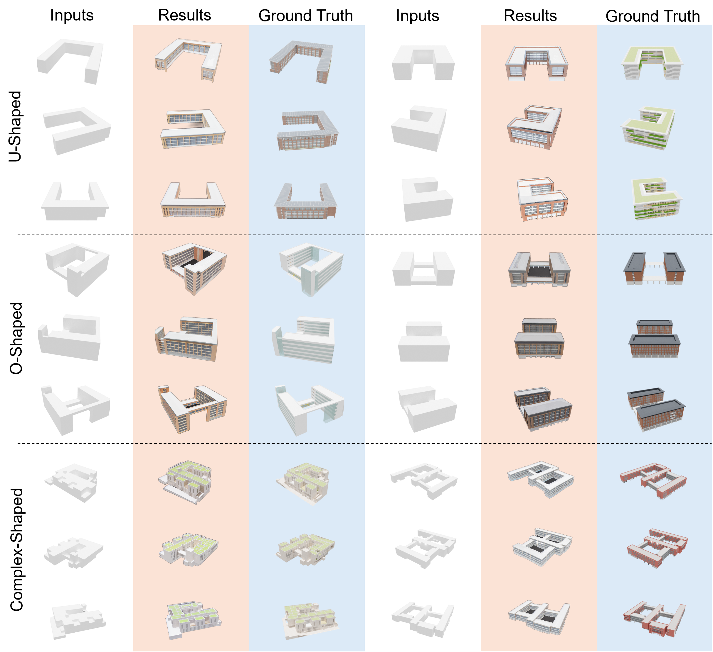
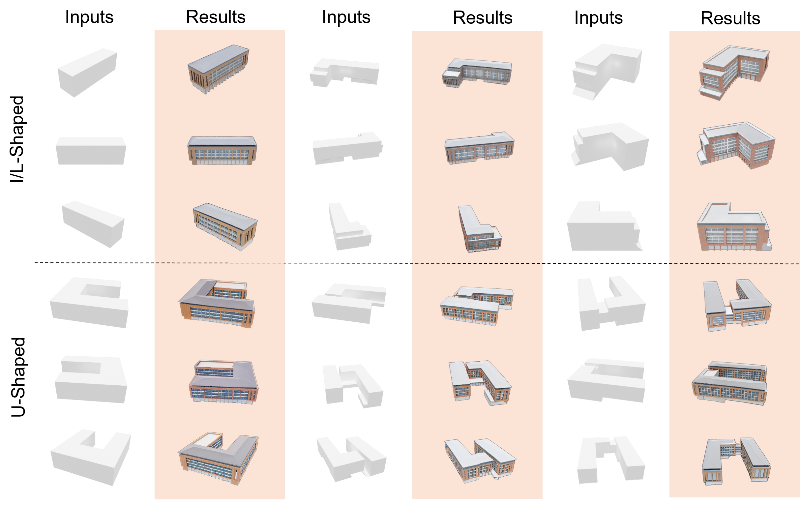

# Multi-View Depth Consistent Image Generation

**Architectural Design Automation from Shoebox Models using Generative AI**  
📄 [Paper (2025)](https://arxiv.org/abs/2503.03068) — *Published at CAADRIA 2025*

🎬 Demo Video – *Coming Soon*

---

## 🔍 Overview

This project proposes a **three-stage generation framework** that transforms simplified **shoebox models** into **multi-view, photorealistic architectural renderings** using generative AI.

We enhance **ControlNet** to process multi-view inputs, apply **monocular depth estimation**, and fuse RGB–depth features using a novel **depth-aware consistency module**. This framework is designed to assist early-stage university building design, improving both **visual quality** and **geometric coherence**.



---

## 🏗️ Core Contributions

- ⚙️ A **multi-view diffusion model** based on ControlNet for generating coherent architectural images.
- 🎨 An **image-space consistency loss** to improve cross-view style, structure, and angle alignment.
- 🧠 A **depth-aware fusion module** using MiDaS and MVD-Fusion to enhance geometric consistency.
- 🏫 A curated **university building dataset**: 12,600 shoebox images paired with 12,600 design renderings.

---

## 🧪 Method Summary

### Stage 1: Multi-View Generation
> Shoebox images → Multi-view ControlNet → Architectural renderings with texture and structure

### Stage 2: Depth Estimation
> Generated views → MiDaS → Depth maps per viewpoint

### Stage 3: Fusion & Consistency Refinement
> (RGB + Depth) → MVD-Fusion → Depth-aligned and style-consistent results

---

## 📦 Dataset

- 🧱 **Shoebox models**: 210 simplified 3D models of university buildings  
- 📸 **Multi-view renderings**: 60 viewpoints/model via Blender  
- 🖼️ **Total samples**: 25,200 RGB–design image pairs  

---

## 📊 Reconstruction Results



---

## 📊 Generation Results



---

## 📊 Evaluation Results

| Metric                 | Reconstruction | Generation |
|------------------------|----------------|------------|
| Structural Integrity   | 3.57           | 3.55       |
| Structural Consistency | 3.53           | 3.43       |
| Detail Integrity       | 3.56           | 3.35       |
| Detail Consistency     | 3.39           | 3.28       |
| Visual Aesthetics      | 3.17           | 3.03       |
| Practicality           | 3.42           | 3.37       |

> 📈 Evaluated by 15 architecture graduate students across 6 dimensions.

---

## 📚 Citation

If you use this work in your research, please cite:

```bibtex
@inproceedings{du2024multiview,
  title={Multi-View Depth Consistent Image Generation Using Generative AI Models: Application on Architectural Design of University Buildings},
  author={Du, Xusheng and Gui, Ruihan and Wang, Zhengyang and Zhang, Ye and Xie, Haoran},
  booktitle={IEEE Conference on Computer Vision},
  year={2024}
}
